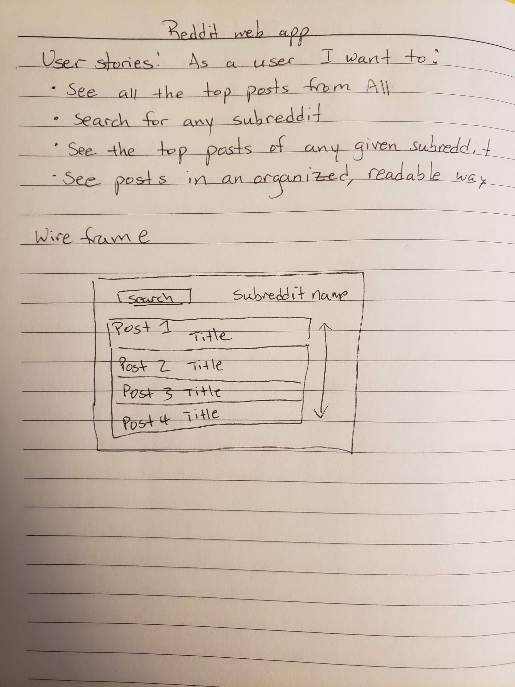

# Subreddit News
Get the top 25 posts of any subreddit of your interest! Not sure what to checkout? The top 25 posts from All are automatically displayed!

## User Stories & Wireframe
As a user, I want to:
- see all the top posts from All
- search for any subreddit
- see the top posts of any given subreddit
- see posts in an organized and readable way

## Technologies Used
- ReactJS
- Javascript
- HTML
- CSS
- Material UI

## Next Steps
- Debug issue obtaining author of each post
- Render comments and replies
- Add thumbnail image to the left of each post, similar to the display on Reddit

## Setup and Installation
1.  Fork and clone this repository.
2.  To contribute, be sure to checkout to a new branch for your work.
3.  Install depdendencies by running `npm install`.
*Depedencies can be found in the package.json file.
4.  To launch the app in your local browser, run `npm start`.
